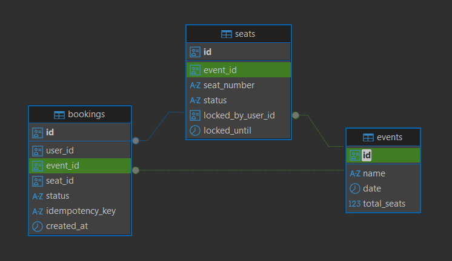

# 🎟️ High-Concurrency Ticket Booking Engine

A high-concurrency ticket booking backend built with **FastAPI, PostgreSQL, Redis, and Celery**, designed to prevent double bookings, handle traffic spikes, recover abandoned reservations, and ensure idempotent payments.

## 🗄️ Database Schema



## 🏗️ Architecture

```text
                         ┌─────────────┐
                         │   Client    │
                         └──────┬──────┘
                                │
                                ▼
                         ┌─────────────┐
                         │   FastAPI   │
                         └──────┬──────┘
                                │
                 ┌──────────────┴──────────────┐
                 ▼                             ▼
          ┌─────────────┐               ┌─────────────┐
          │    Redis    │               │ PostgreSQL  │
          │    Cache    │               │  Source of  │
          └─────────────┘               │    Truth    │
                                        └──────┬──────┘
                                               │
                                               ▼
                                        ┌─────────────┐
                                        │   Celery    │
                                        │   Workers   │
                                        └─────────────┘
```

## ⚡ Key Engineering Highlights

### 🔒 Concurrency Control

Prevents double bookings using PostgreSQL row-level locking inside ACID transactions.

* `FOR UPDATE NOWAIT` for specific seat selection
* `FOR UPDATE SKIP LOCKED` for general admission
* Competing requests fail immediately instead of waiting on locked rows

```sql
SELECT *
FROM seats
WHERE id = :seat_id
FOR UPDATE NOWAIT;
```

### 🚀 Redis Cache-Aside

Seat availability is cached in Redis to reduce repeated database reads.

* 60-second TTL
* Cache invalidation after reservation/cancellation
* PostgreSQL remains the source of truth

```text
Request → Redis HIT → Response
             │
           MISS
             ▼
        PostgreSQL
             │
             ▼
           Redis
```

### ⏱️ Abandoned Cart Recovery

Celery handles reservation expiration asynchronously.

```text
RESERVED → Payment received → CONFIRMED
     │
     └── Timeout → AVAILABLE
```

Expired reservations release the seat and invalidate the Redis cache.

### 🔁 Payment Idempotency

Payment webhooks use unique **idempotency keys** to safely handle retries and prevent duplicate booking confirmation or ticket issuance.

---

## 🛠️ Tech Stack

**Backend:** FastAPI · Python 3.12 · SQLAlchemy 2.0
**Database:** PostgreSQL 15 · asyncpg
**Caching:** Redis 7
**Background Jobs:** Celery
**Validation:** Pydantic v2
**Infrastructure:** Docker · Docker Compose

---

## 📡 API

| Method | Endpoint                           | Purpose               |
| ------ | ---------------------------------- | --------------------- |
| `GET`  | `/api/v1/events/{id}/seats`        | Get seat availability |
| `POST` | `/api/v1/bookings/reserve`         | Reserve a seat        |
| `POST` | `/api/v1/bookings/webhook/payment` | Confirm payment       |
| `GET`  | `/health`                          | Health check          |

---

## 🚀 Quick Start

### 1. Clone & Install

```bash
git clone https://github.com/yourusername/ticket-booking-api.git
cd ticket-booking-api

python -m venv venv
```

**Windows**

```bash
.\venv\Scripts\activate
```

**macOS/Linux**

```bash
source venv/bin/activate
```

```bash
pip install -r requirements.txt
```

### 2. Start PostgreSQL & Redis

```bash
docker-compose up -d
```

### 3. Start FastAPI

```bash
python -m uvicorn app.main:app --reload
```

API docs:

`http://localhost:8000/docs`

### 4. Start Celery

**Windows**

```bash
python -m celery -A app.core.celery_app worker --loglevel=info --pool=solo
```

**macOS/Linux**

```bash
celery -A app.core.celery_app worker --loglevel=info
```

---

## 📊 Performance

* **10,000 concurrent reservation requests** tested against identical inventory
* **Zero double bookings** observed during concurrency testing
* **Sub-5ms** seat-map reads when served from Redis

> Results depend on hardware, network conditions, dataset size, and benchmark methodology.
